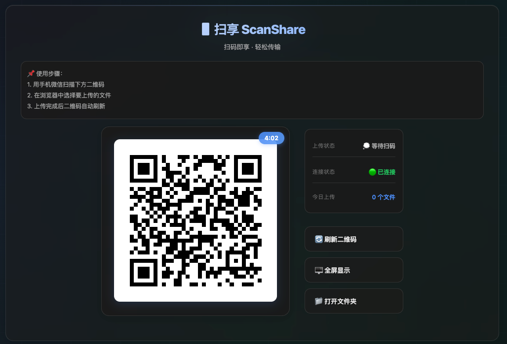
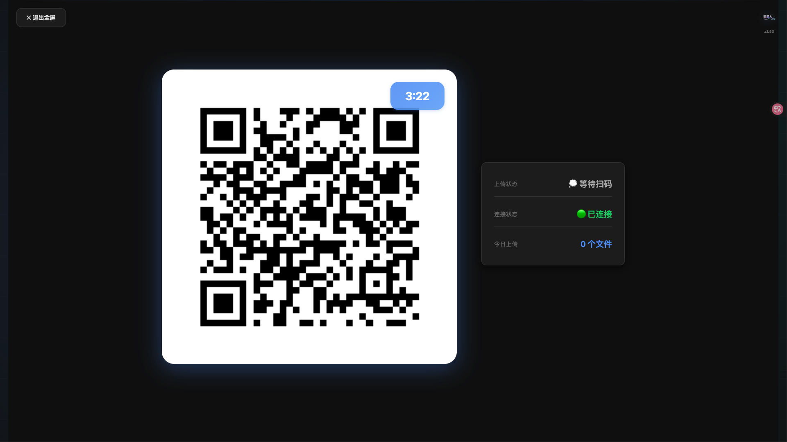

<div align="center">

# 扫享 ScanShare

**扫码即享 · 轻松传输**

一款基于二维码的文件传输工具，让手机与电脑之间的文件传输变得简单快捷。

[](LICENSE)
[](#)
[](https://www.electronjs.org/)
[](https://nodejs.org/)

[功能特性](#功能特性) • [快速开始](#快速开始) • [使用指南](#使用指南) • [开发](#开发) • [打包发布](#打包发布)

</div>

---

## ✨ 功能特性

- 🎯 **扫码传输** - 微信扫一扫即可上传文件
- 🔄 **自动刷新** - 上传完成后二维码自动更新
- ⏱️ **安全时效** - 二维码5分钟有效期，自动过期保护
- 🌐 **局域网访问** - 同一网络下即可使用
- 📊 **实时状态** - WebSocket 实时显示上传状态
- 🖥️ **全屏模式** - 支持全屏展示二维码
- 📁 **快速打开** - 一键打开文件保存文件夹
- 💾 **桌面应用** - 支持 macOS 和 Windows 平台

---

## 📸 预览

### 主界面


### 全屏模式


---

## 🚀 快速开始

### 方式一：使用已打包的应用（推荐）

1. 前往 [Releases](https://github.com/zrt-ai-lab/scanshare/releases) 页面
2. 下载对应平台的安装包：
   - **macOS**: `扫享 ScanShare-1.0.0.dmg`
   - **Windows**: `扫享 ScanShare Setup 1.0.0.exe`
3. 安装并运行应用
4. 使用微信扫描二维码上传文件

### 方式二：从源码运行

#### 前置要求

- Node.js >= 18.0.0
- npm >= 9.0.0

#### 安装步骤

```bash
# 1. 克隆仓库
git clone https://github.com/zrt-ai-lab/scanshare.git
cd scanshare

# 2. 安装依赖
npm install

# 3. 启动应用
npm run electron
```

---

## 📖 使用指南

### 基本使用

1. **启动应用** - 双击打开"扫享 ScanShare"
2. **扫描二维码** - 使用微信"扫一扫"功能
3. **选择文件** - 在浏览器中选择要上传的文件
4. **完成上传** - 文件自动保存到指定文件夹

### 文件保存位置

- **macOS**: `~/Library/Application Support/扫享 ScanShare/uploads/`
- **Windows**: `C:\Users\你的用户名\AppData\Roaming\扫享 ScanShare\uploads\`

可通过"📁 打开文件夹"按钮快速访问。

### 全屏模式

点击"🖥️ 全屏显示"按钮进入全屏模式，适合投影展示。
- 按 `ESC` 键退出全屏
- 或点击左上角"✕ 退出全屏"按钮

---

## ⚙️ 配置说明

编辑 `config.json` 文件可自定义配置：

```json
{
  "uploadPath": "./uploads",        // 文件保存路径
  "port": 3000,                      // 服务端口
  "tokenExpireMinutes": 5,           // 二维码有效期（分钟）
  "maxFileSize": 100,                // 最大文件大小（MB）
  "allowedFileTypes": ["*"]          // 允许的文件类型（*表示全部）
}
```

### 自定义端口

可通过以下方式修改端口：

```bash
# 方式1：修改 config.json
"port": 8080

# 方式2：环境变量
PORT=8080 npm run electron

# 方式3：命令行参数
npm run electron -- 8080
```

---

## 🛠️ 开发

### 项目结构

```
scanshare/
├── public/              # 前端静态文件
│   ├── index.html      # 主页面
│   ├── upload.html     # 上传页面
│   └── zlab.png        # Logo
├── server.js           # Express 服务器
├── electron-main.js    # Electron 主进程
├── config.json         # 配置文件
├── package.json        # 项目配置
└── README.md          # 项目说明
```

### 技术栈

- **前端**: HTML5, CSS3, JavaScript (ES6+)
- **后端**: Node.js, Express, Socket.IO
- **桌面**: Electron
- **其他**: QRCode.js, Multer

### 开发命令

```bash
# 安装依赖
npm install

# 启动 Web 服务（仅后端）
npm start

# 启动 Electron 应用
npm run electron

# 代码检查
npm run lint
```

---

## 📦 打包发布

### macOS 打包

```bash
# 打包为 DMG 安装包
npm run build:mac

# 或者只打包 DMG
npm run build:mac-dmg

# 输出位置
dist/扫享 ScanShare-1.0.0.dmg
dist/扫享 ScanShare-1.0.0-mac.zip
```

**系统要求**:
- macOS 10.13 或更高版本
- 64位处理器

### Windows 打包

```bash
# 打包为 NSIS 安装程序（推荐）
npm run build:win

# 或者只打包 EXE
npm run build:exe

# 或者只打包 MSI
npm run build:msi

# 输出位置
dist/扫享 ScanShare Setup 1.0.0.exe
```

**系统要求**:
- Windows 10 或更高版本
- 64位系统

### 跨平台打包

在 macOS 上可以同时打包两个平台：

```bash
# 同时打包 Mac 和 Windows 版本
npm run build:mac && npm run build:win
```

### 打包配置

修改 `package.json` 中的 `build` 字段可自定义打包选项：

```json
{
  "build": {
    "appId": "com.zlab.scanshare",
    "productName": "扫享 ScanShare",
    "mac": {
      "target": ["dmg", "zip"],
      "category": "public.app-category.utilities"
    },
    "win": {
      "target": ["nsis"]
    }
  }
}
```

---

## 🔧 常见问题

### 1. 无法打开应用（macOS）

如果遇到"无法打开，因为它来自身份不明的开发者"：

```bash
# 解决方法1：右键点击应用 -> 打开

# 解决方法2：系统设置
系统偏好设置 -> 安全性与隐私 -> 点击"仍要打开"

# 解决方法3：终端命令
sudo xattr -r -d com.apple.quarantine "/Applications/扫享 ScanShare.app"
```

### 2. Windows 安装时提示不安全

这是因为应用未签名，可以安全安装：
- 点击"更多信息"
- 选择"仍要运行"

### 3. 手机扫码后无法访问

**原因**：手机和电脑不在同一局域网

**解决方案**：
- 确保连接同一 Wi-Fi
- 检查防火墙设置
- 使用内网穿透服务（如 Cloudflare Tunnel）

### 4. 上传文件找不到

点击"📁 打开文件夹"按钮，或手动访问：
- macOS: `~/Library/Application Support/扫享 ScanShare/uploads/`
- Windows: `%APPDATA%\扫享 ScanShare\uploads\`

### 5. 端口被占用

修改 `config.json` 中的 `port` 为其他值（如 8080）

---

## 🔒 安全说明

- ✅ 二维码采用随机令牌，每次生成都不同
- ✅ 令牌有效期为5分钟，过期自动失效
- ✅ 仅在局域网内访问，不暴露到公网
- ✅ 每个令牌只能使用一次
- ⚠️ 建议在可信网络环境下使用

---

## 📝 更新日志

### v1.0.0 (2025-10-28)

- 🎉 初始版本发布
- ✨ 支持扫码上传文件
- ✨ 自动刷新二维码
- ✨ 全屏展示模式
- ✨ 实时状态显示
- 📦 支持 macOS 和 Windows 打包

---

## 🤝 贡献指南

欢迎提交 Issue 和 Pull Request！

### 开发流程

1. Fork 本仓库
2. 创建特性分支 (`git checkout -b feature/AmazingFeature`)
3. 提交更改 (`git commit -m 'Add some AmazingFeature'`)
4. 推送到分支 (`git push origin feature/AmazingFeature`)
5. 开启 Pull Request

### 代码规范

- 使用 2 空格缩进
- 遵循 ESLint 规则
- 提交信息使用语义化格式

---

## 📄 许可证

本项目采用 MIT 许可证 - 详见 [LICENSE](LICENSE) 文件

---

## 👨‍💻 作者

**ZLab** - [GitHub](https://github.com/zrt-ai-lab)

---

## 🙏 致谢

- [Electron](https://www.electronjs.org/) - 跨平台桌面应用框架
- [Express](https://expressjs.com/) - Node.js Web 框架
- [Socket.IO](https://socket.io/) - 实时通信库
- [QRCode.js](https://davidshimjs.github.io/qrcodejs/) - 二维码生成库
- [Multer](https://github.com/expressjs/multer) - 文件上传中间件

---

## 📮 联系方式

- 📧 Email: your.email@example.com
- 💬 Issues: [GitHub Issues](https://github.com/zrt-ai-lab/scanshare/issues)
- 🌐 Website: https://your-website.com

---

<div align="center">

**如果这个项目对你有帮助，请给个 ⭐️ Star 支持一下！**

Made with ❤️ by ZLab

</div>
